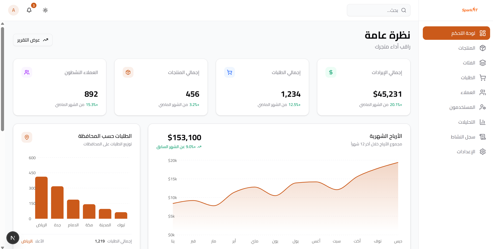

# ✨ SparkIT Administrative Dashboard

A premium, high-performance administrative dashboard designed for modern e-commerce management. Built with speed, aesthetics, and user experience in mind.



## 🚀 Overview

SparkIT Dashboard provides a comprehensive suite of tools for store administrators to manage products, categories, orders, and customers with ease. It features a bilingual interface (English & Arabic) and a responsive design that works beautifully across all devices.

## 🛠️ Tech Stack

- **Core**: [Next.js 15 (App Router)](https://nextjs.org/) & [React 19](https://react.dev/) + [TypeScript](https://www.typescriptlang.org/)
- **Styling**: [Tailwind CSS 4](https://tailwindcss.com/)
- **UI Components**: [Shadcn UI](https://ui.shadcn.com/) & [Radix Primitives](https://www.radix-ui.com/)
- **Icons & Charts**: [Lucide React](https://lucide.dev/) & [Recharts](https://recharts.org/)
- **Experience**: Premium animations using `tailwindcss-animate` and micro-transitions.

## 💎 Features

- **📊 Dashboard Analytics**: Real-time sales metrics, revenue growth, and top-selling products.
- **📦 Inventory Management**: Advanced product management with stock alerts, categories, and image handling.
- **🛒 Order Tracking**: Streamlined order processing interface with real-time status updates (Pending, Processing, Delivered).
- **👥 Customer Relations**: Integrated customer database with order history and lifetime value tracking.
- **🌍 Bilingual Support**: Full RTL support for Arabic, allowing seamless switching between English and Arabic layouts.
- **🌓 Dark Mode**: Intelligent theme provider with system preference support and premium "glassmorphism" effects.

## 🚦 Getting Started

### Prerequisites

- [Node.js](https://nodejs.org/) (v18 or higher)
- [npm](https://www.npmjs.com/) or [yarn](https://yarnpkg.com/)

### Installation

1. **Clone the repository**
   ```bash
   git clone [repository-url]
   cd spark-it-dash
   ```

2. **Install dependencies**
   ```bash
   npm install
   ```

3. **Start the development server**
   ```bash
   npm run dev
   ```

4. **Build for production**
   ```bash
   npm run build
   ```

## 📂 Project Structure

- `src/app`: Next.js pages, layouts, and API route handlers.
- `src/components`: Reusable UI components (buttons, input, dialogs).
- `src/features`: Feature-based modules (products, dashboard, auth, orders, customers).
- `src/services`: Data-fetching and API service integration layer.
- `src/lib`: Utilities, helper functions, and global constants.
- `public`: Static assets including images and logos.

---
Built with ❤️ by the SparkIT Team.
